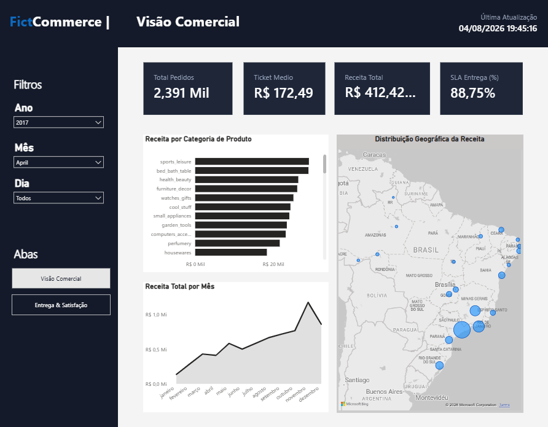
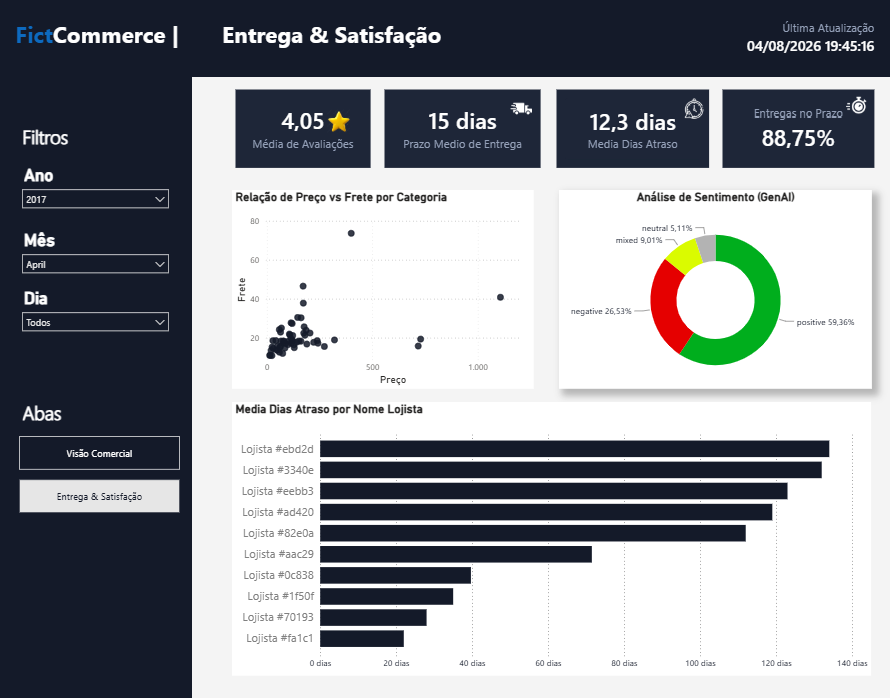

# 🛒 Olist Marketplace Analytics (Databricks Lakehouse)

> **Resumo do Projeto:** Uma plataforma de dados ponta a ponta (End-to-End) construída com dados de e-commerce  fictício. O pipeline processa dados transacionais, aplica **Inteligência Artificial (GenAI)** nativa para análise de sentimento em avaliações de clientes, e expõe os resultados através de um Star Schema otimizado para Dashboards Executivos no Power BI.

---

## 📸 Dashboards e Resultados (Power BI)

### Tela 1: Visão Comercial (C-Level, GMV e Mapa de Calor)

### Tela 2: Visão de Logística e Sentimento com IA (Operações)

*(Veja a pasta `/powerbi` para o arquivo `.pbix` final do projeto).*

---

## 🏛️ Estrutura e Arquitetura de Dados (Medallion)

O pipeline foi construído seguindo a **Medallion Architecture**, orquestrado 100% via código Python
- **🥉 Bronze (Ingestion & Raw):** Ingestão de CSVs via volumes do Unity Catalog, validando schemas e salvando em formato Delta.
- **🥈 Silver (Cleansing, Conformed & AI):** Limpeza, deduplicação e aplicação de chamadas nativas de LLM (`ai_analyze_sentiment`) para analisar textos de milhares de avaliações, classificando-as automaticamente.
- **🥇 Gold (Business & Analytics):** Modelagem dimensional (Fato e Dimensões) prontas para o consumo das ferramentas de BI.

---

## 🚀 Tecnologias do Ecossistema Databricks Utilizadas

- **Databricks Unity Catalog:** Governança centralizada, gestão de Schemas lógicos e Volumes para arquivos brutos.
- **Databricks AI Functions:** Integração de Large Language Models (LLMs) direta no processamento de dados (Análise de Sentimentos).
- **Databricks Workflows (Lakeflow):** Orquestração automática das dependências do pipeline.
- **Delta Lake:** Versionamento de dados e transações ACID compliance em todas as camadas.
- **Framework de Data Quality:** Testes e validações executados programaticamente durante o pipeline.

---

## ⚙️ Como Utilizar / Reproduzir este Projeto

1. **Dados Brutos (CSVs):**
   - Os arquivos CSV originais da Olist já estão salvos neste repositório dentro da pasta `data/raw/`.
   - O volume de destino será criado automaticamente no passo 2.

2. **Executar o Setup de Infraestrutura (Apenas 1 Vez):**
   - Execute o script `scripts/setup_databases.py` como um Databricks Job.
   - *Nota:* Ele cria automaticamente os schemas `bronze`, `silver`, `gold` e os volumes necessários. O script calcula caminhos relativos automaticamente, funcionando independente do e-mail do usuário no Databricks.

3. **Orquestrar o Pipeline:**
   - Faça o upload dos CSVs da pasta `data/raw/` para o volume: `Catalog > seu_catalogo > bronze > raw_volume`.
   - Importe a configuração `workflows/pipeline_orchestration.json` na aba "Workflows" (Jobs) do Databricks.
   - Clique em **Run Now**. O Lakeflow irá processar todas as camadas respeitando a dependência (Bronze > Silver > Gold).

4. **Visualizar no Power BI:**
   - Abra o arquivo `.pbix` disponível na pasta `powerbi/`.
   - Modifique a fonte de dados inserindo o hostname do seu próprio cluster Databricks SQL.

---

## 🤖 Uso de Inteligência Artificial e Agentes (BMad)

A concepção e o planejamento inicial deste projeto foram metodologicamente auxiliados pelo framework de agentes estruturados **BMad**. 

Os agentes de inteligência artificial atuaram nos papéis estratégicos de **Product Manager, Business Analyst e Arquiteto de Software**, produzindo em conjunto toda a documentação fundacional da plataforma:
- Elaboração do **PRD (Product Requirements Document)** focado em negócio.
- Desenho do Documento de **Arquitetura Técnica (Lakehouse, Medallion)**.
- Mapeamento e quebra de **Épicos, Histórias de Usuário e Critérios de Aceite**.
- Definição de User Scenarios e fluxos operacionais.
