# 🏗️ Arquitetura Técnica — Olist Marketplace Analytics Platform (Databricks Free Serverless Edition)

> **Plataforma de analytics end-to-end** para análise de operações do marketplace Olist (B2C brasileiro),
> construída sobre a **Arquitetura Medallion** no **Unity Catalog** com Delta Lake, **Unity Catalog Volumes**,
> **Auto Loader**, **AI Functions** e Power BI. Processa ~112k itens de pedidos do dataset público Olist
> (Set/2016 – Out/2018): receita, logística de entrega, NPS por categoria e performance de sellers.

---

## Índice

1. [Visão Geral da Arquitetura](#1-visao-geral-da-arquitetura)
2. [Decisões Arquiteturais Fundamentais (Invariantes)](#2-decisoes-arquiteturais-fundamentais-invariantes)
3. [Stack Tecnológico e Justificativas](#3-stack-tecnologico-e-justificativas)
4. [Camadas da Arquitetura Medallion no Unity Catalog](#4-camadas-da-arquitetura-medallion-no-unity-catalog)
5. [Modelo de Dados (Star Schema)](#5-modelo-de-dados-star-schema)
6. [Framework de Qualidade de Dados](#6-framework-de-qualidade-de-dados)
7. [Orquestração e Fluxo de Execução](#7-orquestracao-e-fluxo-de-execucao)
8. [Estrutura de Pastas do Repositório](#8-estrutura-de-pastas-do-repositorio)
9. [Convenções e Contratos de Interface](#9-convencoes-e-contratos-de-interface)
10. [Escalabilidade e Evolução](#10-escalabilidade-e-evolucao)
11. [Segurança e Governança](#11-seguranca-e-governanca)
12. [Roadmap de Evolução (v3.0+)](#12-roadmap-de-evolucao-v30)

---

## 1. Visão Geral da Arquitetura

### 1.1 Contexto do Negócio: Marketplace Generalista Olist

O dataset representa o **marketplace Olist** — plataforma B2C brasileira que conecta sellers independentes a consumidores. O pipeline responde às perguntas reais de negócio:

| Domínio | Pergunta de Negócio Respondida | Tabela Responsável |
|---|---|---|
| **Logística** | % entregas no prazo por estado | `fact_sales.entregue_no_prazo` |
| **Financeiro** | Receita por categoria e mês | `fact_sales` ↔ `dim_products` |
| **Sellers** | Ranking receita + NPS por seller | `fact_sales` + `fact_reviews` ↔ `dim_sellers` |
| **Satisfação** | NPS por categoria; impacto do atraso na nota | `fact_reviews.entregue_antes_prazo` + `review_score` |

### 1.2 Diagrama da Arquitetura

```mermaid
flowchart LR
    subgraph SOURCES["Arquivos Brutos (Olist CSVs — 9 arquivos)"]
        CSV["99k pedidos | 3k sellers | 71 categorias\nSet/2016 – Out/2018"]
    end

    subgraph DATABRICKS["Databricks Free Serverless Platform"]
        direction TB
        subgraph VOLUMES["Unity Catalog Volumes"]
            V1["/Volumes/workspace/bronze/raw_volume/*.csv"]
        end
        subgraph BRONZE["Bronze - Schema (Raw Delta — 9 tabelas)"]
            B1["workspace.bronze.olist_orders"]
            B2["workspace.bronze.olist_customers"]
            B3["workspace.bronze.olist_order_items"]
            B4["workspace.bronze.olist_products"]
            B5["workspace.bronze.olist_sellers"]
            B6["workspace.bronze.olist_order_payments"]
            B7["workspace.bronze.olist_order_reviews"]
            B8["workspace.bronze.olist_geolocation"]
            B9["workspace.bronze.product_category_names"]
        end
        subgraph SILVER["Silver - Schema (Curated Delta — 3 tabelas + quarantine)"]
            S1["workspace.silver.orders_enriched\n(SLA logístico + pagamento)"]
            S2["workspace.silver.reviews_enriched\n(NPS + AI Functions sentimento)"]
            S3["workspace.silver.geolocation_aggregated\n(CEPs limpos + regiao_brasil)"]
            SQ["workspace.silver.quarantine"]
        end
        subgraph GOLD["Gold - Schema (Dimensional Delta — Star Schema Olist)"]
            G1["workspace.gold.dim_customers"]
            G2["workspace.gold.dim_products\n(categoria PT/EN + volume_cm3)"]
            G3["workspace.gold.dim_sellers\n(regiao_brasil)"]
            G4["workspace.gold.dim_time\n(2016-2018, PT)"]
            G5["workspace.gold.fact_sales\n(grain: order_item_id\n+ SLA logístico)"]
            G6["workspace.gold.fact_reviews\n(grain: review_id\n+ entregue_antes_prazo)"]
            G7["workspace.gold.kpi_marketplace_monthly\n(NPS + taxa_entrega_no_prazo)"]
        end
        WF["Databricks Lakeflow\n(Serverless Workflows)"]
        AI["Databricks AI Functions\n(ai_analyze_sentiment)"]
    end

    subgraph BI["Consumo & Insights"]
        PBI["Power BI Desktop\n3 páginas: Overview | Logística | Sellers"]
        GEN["Databricks Genie Space\n(Perguntas em linguagem natural)"]
    end

    CSV --> VOLUMES
    VOLUMES -->|Auto Loader cloudFiles| BRONZE
    BRONZE --> SILVER
    AI -.->|enriquece| S2
    SILVER --> GOLD
    GOLD --> PBI
    GOLD --> GEN
    WF -..->|"orquestra"| VOLUMES
```



### 1.3 Princípios Arquiteturais

| Princípio | Aplicação Concreta |
|---|---|
| **Namespace de 3 Níveis** | Todas as tabelas: `workspace.schema.table` |
| **Volumes do Unity Catalog** | CSVs em `/Volumes/workspace/bronze/raw_volume/` |
| **Computação Serverless** | Notebooks e SQL Warehouse sem gestão de cluster |
| **Linhagem Nativa UC** | Lineage automático Bronze → Silver → Gold → Power BI |
| **Imutabilidade de Raw** | Bronze nunca modificada; Delta time travel disponível |
| **Fail Fast, Fail Loud** | Quality checks bloqueantes em todas as camadas |
| **AI Nativa** | Sentimento de reviews via Databricks AI Functions |

---

## 2. Decisões Arquiteturais Fundamentais (Invariantes)

### AD-1: Unity Catalog como Mecanismo de Governança
- **Decisão:** Catálogo `workspace` com schemas `bronze`, `silver`, `gold`.
- **Fixa:** Namespace de 3 níveis em todas as leituras e escritas.
- **Impede:** Tabelas no `hive_metastore` legado e referências a caminhos físicos de blob.
- **Status:** `[ADOPTED]`

### AD-2: Unity Catalog Volumes para Arquivos Raw
- **Decisão:** Volume `workspace.bronze.raw_volume` para os CSVs originais.
- **Fixa:** Path `/Volumes/workspace/bronze/raw_volume/`
- **Impede:** Mounts DBFS legados (`dbutils.fs.mount`), incompatíveis com Serverless.
- **Status:** `[ADOPTED]`

### AD-3: Auto Loader (`cloudFiles`) para Ingestão Bronze
- **Decisão:** PySpark Auto Loader para leitura dos CSVs.
- **Fixa:** Inferência de schemas + checkpointing para idempotência.
- **Impede:** `spark.read.csv()` sem controle de evolução de schemas.
- **Status:** `[ADOPTED]`

### AD-4: Computação Serverless (Notebooks & SQL Warehouses)
- **Decisão:** Notebooks em Serverless Notebook Compute; BI no Serverless SQL Warehouse (2X-Small).
- **Fixa:** Inicialização em segundos; limite de 1 Warehouse SQL no Free Edition.
- **Impede:** Clusters All-Purpose clássicos.
- **Status:** `[ADOPTED]`

### AD-5: Star Schema Kimball para a Camada Gold
- **Decisão:** Modelagem dimensional com surrogate keys inteiras. Unknown key = -1.
- **Fixa:** Surrogate keys via `monotonically_increasing_id()`.
- **Impede:** Joins por string keys ou FKs nulas nas tabelas fato.
- **Status:** `[ADOPTED]`

### AD-6: Métricas de SLA Logístico Embutidas na fact_sales
- **Decisão:** Os campos `entregue_no_prazo` (boolean), `dias_para_entrega` e `dias_atraso` são calculados na camada Silver (`orders_enriched`) e promovidos para a `fact_sales`.
- **Motiva:** O modelo de negócio Olist depende fundamentalmente de SLA — atraso impacta diretamente o NPS.
- **Fixa:** SLA é um atributo de negócio de primeira classe, não um campo derivado de BI.
- **Status:** `[ADOPTED]`

### AD-7: AI Functions para Análise de Sentimento de Reviews
- **Decisão:** Campo `sentimento` em `reviews_enriched` gerado via `ai_analyze_sentiment()` do Databricks Foundation Models, executado na camada Silver.
- **Motiva:** O dataset tem ~99k reviews com texto — análise de sentimento nativa elimina a necessidade de lógica heurística simplificada.
- **Fixa:** O campo `sentimento` é um dado de negócio computado uma vez na Silver, não calculado em runtime de BI.
- **Status:** `[ADOPTED]`

### AD-8: Databricks Genie Space para Analytics Self-Service
- **Decisão:** Genie Space configurado sobre `workspace.gold.*`.
- **Motiva:** Perguntas operacionais simples sem necessidade de SQL manual.
- **Fixa:** Herda controles de segurança do Unity Catalog.
- **Status:** `[ADOPTED]`

---

## 3. Stack Tecnológico e Justificativas

| Componente | Escolhido | Alternativa Considerada | Razão |
|---|---|---|---|
| **Plataforma** | Databricks Free Serverless | Community Edition | Free Edition: Serverless + UC + Genie + AI Functions |
| **Engine** | PySpark + Serverless | Classic Cluster | Startup imediato; sem custo ocioso |
| **Raw Storage** | UC Volumes | DBFS mounts | Única opção compatível com Serverless |
| **Ingestão** | Auto Loader (`cloudFiles`) | `spark.read.csv` | Schema inference + checkpointing |
| **Sentimento** | Databricks AI Functions | CASE WHEN score >= 4 | 99k reviews com texto merecem análise real de NLP |
| **BI** | Power BI Desktop + SQL Warehouse | Databricks Dashboards | Requisito explícito do produto; SQL Warehouse serverless garante performance |
| **Self-Service** | Databricks Genie | Relatórios manuais adicionais | Perguntas operacionais em PT sem SQL manual |

---

## 4. Camadas da Arquitetura Medallion no Unity Catalog

### 4.1 Volume Bronze (Raw Storage)
Path: `/Volumes/workspace/bronze/raw_volume/`

Arquivos esperados:
- `olist_orders_dataset.csv` — 99.441 linhas
- `olist_customers_dataset.csv` — 99.441 linhas
- `olist_order_items_dataset.csv` — 112.650 linhas
- `olist_products_dataset.csv` — 32.951 linhas
- `olist_sellers_dataset.csv` — 3.095 linhas
- `olist_order_payments_dataset.csv` — 103.886 linhas
- `olist_order_reviews_dataset.csv` — 99.224 linhas
- `olist_geolocation_dataset.csv` — grande (lat/lng por CEP)
- `product_category_name_translation.csv` — 71 linhas

### 4.2 Bronze Layer — 9 Tabelas Raw
Schema: `workspace.bronze`

| Tabela | Origem | Registros |
|---|---|---|
| `olist_orders` | olist_orders_dataset.csv | 99.441 |
| `olist_customers` | olist_customers_dataset.csv | 99.441 |
| `olist_order_items` | olist_order_items_dataset.csv | 112.650 |
| `olist_products` | olist_products_dataset.csv | 32.951 |
| `olist_sellers` | olist_sellers_dataset.csv | 3.095 |
| `olist_order_payments` | olist_order_payments_dataset.csv | 103.886 |
| `olist_order_reviews` | olist_order_reviews_dataset.csv | 99.224 |
| `olist_geolocation` | olist_geolocation_dataset.csv | grande |
| `product_category_names` | product_category_name_translation.csv | 71 |

Campos adicionais em todas: `_ingestion_timestamp`, `_source_file`

### 4.3 Silver Layer — 3 Tabelas Curadas + Quarantine
Schema: `workspace.silver`

#### `orders_enriched` — Transações Completas do Marketplace

Join: orders + customers + order_items + products + sellers + payments

Campos calculados chave:
```
valor_total_pedido       = SUM(preco + frete) por order_id
quantidade_itens         = COUNT(order_item_id) por order_id
dias_para_entrega        = DATEDIFF(order_delivered_customer_date, order_purchase_timestamp)
dias_estimados           = DATEDIFF(order_estimated_delivery_date, order_purchase_timestamp)
entregue_no_prazo        = (order_delivered_customer_date <= order_estimated_delivery_date)
dias_atraso              = DATEDIFF(order_delivered_customer_date, order_estimated_delivery_date)
                           # negativo = adiantado, positivo = atrasado
forma_pagamento_principal = payment_type mais frequente por order_id
max_parcelas              = MAX(payment_installments) por order_id
```

#### `reviews_enriched` — NPS e Satisfação

Join: reviews + orders + order_items + products + sellers

Campos calculados:
```
sentimento              = ai_analyze_sentiment(review_comment_message)
                          # 'positivo' | 'neutro' | 'negativo'
tempo_ate_avaliacao     = DATEDIFF(review_creation_date, order_delivered_customer_date)
category_name_pt        = JOIN com product_category_names
category_name_en        = JOIN com product_category_names
entregue_antes_prazo    = (order_delivered_customer_date <= order_estimated_delivery_date)
```

#### `geolocation_aggregated` — Base Geográfica por CEP

```
zip_code_prefix   = chave de agregação
lat               = AVG(geolocation_lat) com remoção de outliers
lng               = AVG(geolocation_lng)
city              = FIRST(geolocation_city)
state             = FIRST(geolocation_state)
regiao_brasil     = CASE state:
                    Norte: AM, RR, AP, PA, TO, RO, AC
                    Nordeste: MA, PI, CE, RN, PB, PE, AL, SE, BA
                    Centro-Oeste: MT, MS, GO, DF
                    Sudeste: SP, RJ, MG, ES
                    Sul: PR, SC, RS
```

### 4.4 Gold Layer — Star Schema Olist
Schema: `workspace.gold`

| Tabela | Grain | Registros Esperados |
|---|---|---|
| `dim_customers` | customer_unique_id | ~96k + 1 Unknown |
| `dim_products` | product_id | ~33k + 1 Unknown |
| `dim_sellers` | seller_id | ~3k + 1 Unknown |
| `dim_time` | date (2016-2018) | 1.096 datas |
| `fact_sales` | order_item_id | ~112k |
| `fact_reviews` | review_id | ~99k |
| `kpi_marketplace_monthly` | ano + mes | ~25 meses |

---

## 5. Modelo de Dados (Star Schema)

### 5.1 Diagrama do Star Schema Olist

```
                    ┌────────────────────────┐
                    │   dim_customers        │
                    │────────────────────────│
                    │ customer_key (PK int)  │
                    │ customer_unique_id     │
                    │ zip_code_prefix        │
                    │ cidade                 │
                    │ estado                 │
                    │ regiao_brasil          │
                    │ lat, lng               │
                    └───────────┬────────────┘
                                │
    ┌──────────────────┐        │         ┌──────────────────────┐
    │  dim_products    │        │         │     dim_sellers      │
    │──────────────────│        │         │──────────────────────│
    │ product_key (PK) │        │         │ seller_key (PK int)  │
    │ product_id       │        │         │ seller_id            │
    │ category_pt      │        │         │ cidade               │
    │ category_en      │        │         │ estado               │
    │ peso_g           │        │         │ regiao_brasil        │
    │ volume_cm3       │        │         │ lat, lng             │
    └────────┬─────────┘        │         └──────────┬───────────┘
             │                  │                    │
             │     ┌────────────┴──────────────┐     │
             └─────│       fact_sales           │─────┘
                   │───────────────────────────│
                   │ order_item_id (PK degener) │
                   │ customer_key (FK → -1)     │
                   │ product_key (FK → -1)      │
                   │ seller_key (FK → -1)       │
                   │ date_key (FK)              │
                   │ order_id (degenerado)      │
                   │ order_status               │
                   │ payment_type               │
                   │ max_parcelas               │
                   │ preco_produto              │
                   │ valor_frete                │
                   │ valor_total_item           │
                   │ quantidade                 │
                   │ ── SLA Logístico ──        │
                   │ dias_para_entrega          │
                   │ dias_estimados             │
                   │ entregue_no_prazo (bool)   │
                   │ dias_atraso                │
                   └────────────┬──────────────┘
                                │
                    ┌───────────┴────────────┐
                    │      dim_time          │
                    │────────────────────────│
                    │ date_key (PK YYYYMMDD) │
                    │ date                   │
                    │ ano, mes, trimestre    │
                    │ semana_ano             │
                    │ dia_semana             │
                    │ nome_mes_pt            │
                    │ nome_dia_semana_pt     │
                    │ eh_fim_de_semana       │
                    └────────────────────────┘

                    ┌────────────────────────────────┐
                    │         fact_reviews            │
                    │────────────────────────────────│
                    │ review_id (PK degenerado)       │
                    │ customer_key (FK → -1)          │
                    │ seller_key (FK → -1)            │
                    │ product_key (FK → -1)           │
                    │ date_key (FK, data do review)   │
                    │ review_score (1-5)              │
                    │ tempo_ate_avaliacao_dias         │
                    │ sentimento (pos/neu/neg)         │
                    │ entregue_antes_prazo (bool)      │
                    │ category_en (degenerado)         │
                    └────────────────────────────────┘

                    ┌────────────────────────────────────┐
                    │      kpi_marketplace_monthly        │
                    │────────────────────────────────────│
                    │ ano, mes (PK composta)              │
                    │ receita_total                       │
                    │ ticket_medio                        │
                    │ qtd_pedidos                         │
                    │ qtd_clientes_unicos                 │
                    │ qtd_sellers_ativos                  │
                    │ taxa_cancelamento                   │
                    │ taxa_entrega_no_prazo               │
                    │ prazo_medio_entrega_dias            │
                    │ nps_score                           │
                    │ nota_media_reviews                  │
                    └────────────────────────────────────┘
```

### 5.2 Cálculo do NPS Score

```
nps_score = (promotores - detratores) / total_com_review * 100

Onde:
  promotores  = reviews com score 4 ou 5
  neutros     = reviews com score 3
  detratores  = reviews com score 1 ou 2
```

---

## 6. Framework de Qualidade de Dados

Logs em tabelas Delta do Unity Catalog em cada schema:
- `workspace.bronze.quality_logs`
- `workspace.silver.quality_logs`
- `workspace.gold.quality_logs`

| Camada | Checks Críticos (Bloqueantes) |
|---|---|
| **Bronze** | Contagem > 0 por tabela; PKs não nulas; datas no range 2016-2018 |
| **Silver** | Referential integrity; zero duplicatas por PK; quarantine rate < 5% |
| **Gold** | FK integrity (fatos → dims); SKs únicos; reconciliação receita_total; Unknown -1 presente |

---

## 7. Orquestração e Fluxo de Execução

Pipeline no **Databricks Lakeflow (Serverless Workflows)**:

```
Task 1: Ingestão Bronze (Auto Loader)
Task 2: QA Bronze (bloqueante)
   ↓
Task 3: Silver — orders_enriched
Task 4: Silver — reviews_enriched (+ AI Functions)
Task 5: Silver — geolocation_aggregated
Task 6: QA Silver (bloqueante)
   ↓
Task 7: Gold — Dimensões (customers, products, sellers, time)
Task 8: Gold — Fatos (fact_sales, fact_reviews)
Task 9: Gold — Agregações (kpi_marketplace_monthly)
Task 10: QA Gold (bloqueante)
```

- Retry automático: 1x em caso de falha por task
- Notificações no log do Lakeflow
- Tempo esperado: < 15 minutos total em Serverless

---

## 8. Estrutura de Pastas do Repositório

```
olist-marketplace-analytics/
├── README.md                     # Contexto Olist + setup guide + diagramas
├── .gitignore                    # Bloqueia: data/raw/, *.pbix, *.env, __pycache__
│
├── data/
│   └── raw/                      # 9 CSVs Olist (ignorados no Git)
│
├── notebooks/
│   ├── 01_bronze/
│   │   ├── ingest_bronze.py
│   │   └── bronze_quality_checks.py
│   ├── 02_silver/
│   │   ├── transform_orders.py        # → orders_enriched (SLA logístico)
│   │   ├── transform_reviews.py       # → reviews_enriched (AI Functions)
│   │   ├── transform_geolocation.py   # → geolocation_aggregated
│   │   └── silver_quality_checks.py
│   ├── 03_gold/
│   │   ├── create_dimensions.py       # dim_customers, dim_products, dim_sellers, dim_time
│   │   ├── create_facts.py            # fact_sales, fact_reviews
│   │   ├── create_aggregations.py     # kpi_marketplace_monthly
│   │   └── gold_quality_checks.py
│   └── 99_utils/
│       ├── config.py
│       ├── data_quality.py
│       └── transformations.py
│
├── workflows/
│   └── pipeline_orchestration.json
│
├── powerbi/
│   ├── olist_marketplace.pbix
│   └── connection_guide.md
│
├── docs/
│   ├── architecture.md
│   ├── data_model.md
│   ├── setup_guide.md
│   └── quality_framework.md
│
└── scripts/
    └── setup_databases.py        # Cria schemas + Volume no Unity Catalog
```

---

## 9. Convenções e Contratos de Interface

### Contrato de Referência de Tabelas

```python
# CORRETO — 3-level namespace Unity Catalog
orders_df = spark.table("workspace.bronze.olist_orders")
enriched_df = spark.table("workspace.silver.orders_enriched")

# CORRETO — Acesso a Volume
csv_path = "/Volumes/workspace/bronze/raw_volume/olist_orders_dataset.csv"

# PROIBIDO — Referências legadas
# spark.sql("SELECT * FROM bronze.olist_orders")  # sem catálogo
# dbutils.fs.ls("dbfs:/...")                       # DBFS legacy
```

### Módulo `utils/config.py`

```python
class Config:
    CATALOG_NAME          = "workspace"
    BRONZE_SCHEMA         = "bronze"
    SILVER_SCHEMA         = "silver"
    GOLD_SCHEMA           = "gold"
    RAW_VOLUME_PATH       = "/Volumes/workspace/bronze/raw_volume/"
    QA_MAX_NULL_RATE      = 0.05
    QA_MAX_QUARANTINE_RATE = 0.05
    DIM_UNKNOWN_KEY       = -1
    # Período esperado do dataset
    DATA_MIN_DATE         = "2016-01-01"
    DATA_MAX_DATE         = "2018-12-31"
```

### Naming Conventions

| Artefato | Padrão | Exemplo |
|---|---|---|
| Tabelas Bronze | `workspace.bronze.olist_*` | `workspace.bronze.olist_orders` |
| Tabelas Silver | `workspace.silver.*_enriched/aggregated` | `workspace.silver.orders_enriched` |
| Dimensões Gold | `workspace.gold.dim_*` | `workspace.gold.dim_sellers` |
| Fatos Gold | `workspace.gold.fact_*` | `workspace.gold.fact_sales` |
| KPIs Gold | `workspace.gold.kpi_*_monthly` | `workspace.gold.kpi_marketplace_monthly` |
| Colunas | `snake_case` | `entregue_no_prazo`, `dias_atraso` |
| Surrogate keys | `<entidade>_key` (int) | `seller_key`, `product_key` |
| Business keys | `<entidade>_id` (string) | `seller_id`, `product_id` |

---

## 10. Escalabilidade e Evolução

O Unity Catalog gera linhagem automática de cada campo. Uma mudança em `olist_orders` na Bronze mostra quais tabelas Silver, Gold e dashboards Power BI são impactados — essencial para um marketplace com evolução constante de schema.

**Particionamento:** `fact_sales` particionada por `ano` e `mes` suporta 10x o volume sem redesign.

---

## 11. Segurança e Governança

Unity Catalog permite controle de acesso granular:
```sql
-- Analistas de BI acessam apenas Gold
GRANT SELECT ON SCHEMA workspace.gold TO `analysts`;

-- Engenheiros acessam todas as camadas
GRANT ALL PRIVILEGES ON SCHEMA workspace.bronze TO `data_engineers`;
```

Dados sensíveis (CSVs originais) ficam no Volume bronze, inacessíveis via SQL para usuários sem permissão explícita.

---

## 12. Roadmap de Evolução (v3.0+)

- **P1:** Integração Genie Space com Teams/Slack para perguntas operacionais em PT
- **P2:** Análise preditiva de churn de sellers via Databricks MLflow
- **P3:** Row-Level Security por estado do seller no Power BI
- **P4:** Carga incremental com Delta MERGE para atualizações diárias
- **P5:** Migração para dbt-databricks em Serverless SQL Warehouse

---

*Documento gerado por: Winston (bmad-agent-architect)*
*Data: 2026-07-24 | Versão: 2.0 | Status: final*
*Idioma: Português (BR) | Baseado em análise real dos CSVs Olist*
